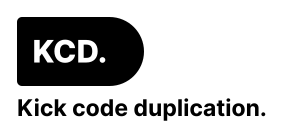

<p align="center">
	
</p>
<p align="center">
	<a href="https://github.com/expectedsh/kcd/actions">
		</a>
	<a href="https://goreportcard.com/report/github.com/expectedsh/kcd">
		</a>
	<a href='https://coveralls.io/github/alexisvisco/kcd?branch=master'>
        </a>
    <a href='https://app.fossa.com/projects/git%2Bgithub.com%2Fexpectedsh%2Fkcd?ref=badge_shield'>
            </a>

</p>

------

<p align="center">
	
</p>

## :stars: KCD

KCD is a grandiose REST helper that wrap your shiny handler into a classic http handler. It manages all you want for
building REST services.

This library is **opinionated** by default but **customizable** which mean it uses some other libraries like Chi,
Logrus... KCD is modular so each pieces of the code that rely on a specific library can be changed.

## :muscle: Example

- [*Demo simple*](examples/demo/main.go)
- [*Bind query parameters*](examples/input-from-query-parameter/main.go)
- [*Bind path parameters*](examples/input-from-path-parameter/main.go)
- [*Bind json body*](examples/input-from-json-body/main.go)
- [*Bind context value*](examples/input-from-ctx/main.go)
- [*Set default value*](examples/input-with-default-value/main.go)
- [*Split string with exploder tag*](examples/input-with-exploder/main.go)
- [*Nested struct*](examples/input-with-nested-struct/main.go)
- [*Validation*](examples/demo-validation)
- [*Errors*](examples/demo-errors)
- [*Real world example: pagination*](examples/demo-ordered-pagination)

## :rocket: QuickStart

```go
package main

import (
	"fmt"
	"net/http"

	"github.com/go-chi/chi"
	"github.com/go-chi/chi/middleware"

	"github.com/expectedsh/kcd"
)

func main() {
	r := chi.NewRouter()
	r.Use(middleware.RequestID)

	// You can configure kcd with kcd.Config

	r.Get("/{name}", kcd.Handler(YourHttpHandler, http.StatusOK))
	//                       ^ Here the magic happen this is the only thing you need
	//                         to do. Adding kcd.Handler(your handler)
	_ = http.ListenAndServe(":3000", r)
}

// CreateCustomerInput is an example of input for an http request.
type CreateCustomerInput struct {
	Name     string   `path:"name"`                 // you can extract value from: 'path', 'query', 'header', 'ctx'
	Emails   []string `query:"emails" exploder:","` // exploder split value with the characters specified
	Subject  string   `json:"body"`                 // it also works with json body
}

// CustomerOutput is the output type of the http request.
type CreateCustomerOutput struct {
	Name string `json:"name"`
}

// YourHttpHandler is your http handler but in a shiny version.
// You can add *http.ResponseWriter or http.Request in params if you want.
func YourHttpHandler(in *CreateCustomerInput) (CreateCustomerOutput, error) {
	// do some stuff here
	fmt.Printf("%+v", in)

	return CreateCustomerOutput{Name: in.Name}, nil
}
```

## :coffee: Benefits

- More readable code
- Focus on what it matters: business code
- No more code duplication with unmarshalling, verifying, validating, marshalling ...
- You could have one interface for the client and server implementation


